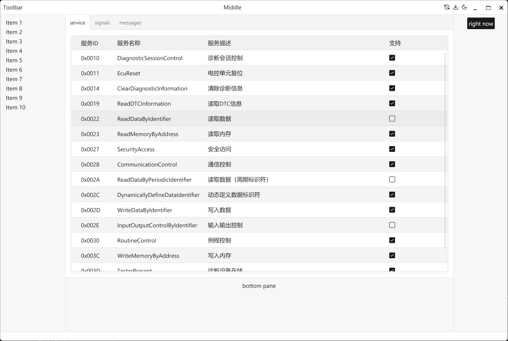

## Auto UI

Auto-ui is a UI Framework based on Rust and Auto lang.

Auto-ui uses [GPUI](https://www.gpui.rs/) as the underlying graphics library,
and refers to [GPUI-Component](https://github.com/longbridgeapp/gpui-component) for component design and implementation.


## Examples

### HelloWorld and Counter

HelloWorld:

```rust
app {
    center {
        text("Hello, World!")
    }
}
```

Counter:

```rust
widget counter {
    model {
        var count = 0
    }
    view {
        button("+") {
            onclick: || count = count + 1
        }
        text(f"Count: $count")
        button("-") {
            onclick: || count = count - 1
        }
        button("reset") {
            onclick: || count = 0
        }
    }
}
```

<p float="left">
    
    
</p>

### Table in a workspace

```rust
app {
    left {
        list(items)
    }
    center {
        tabs {
            tab("service") {
                table("service", ref service_grid)
            }
            tab("signals") {
                text("signals")
            }
            tab("messages") {
                text("messages")
            }
        }
    }
    right {
        button("right now") {
            onclick : || message("right now")
        }
    }
    bottom {
        text("bottom pane")
    }
}
```



## References

- [GPUI](https://gpui.rs)
- [Zed Editor](https://zed.dev/)
- [GPUI-Component](https://github.com/longbridgeapp/gpui-component)

## Related Licenses

- [GPUI](references/LICENSE_GPUI)
- [GPUI-Component](references/LICENSE_GPUI-Component)

