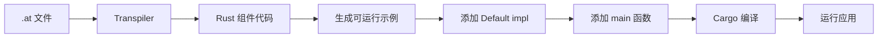

# AutoUI Run 命令使用指南

## 概述

`auto-ui-transpile run` 命令提供了一个一键式解决方案,从 Auto 语言源文件直接运行 UI 应用程序。该命令自动完成以下步骤:

1. **转译** - 将 `.at` 文件转译为 Rust 代码
2. **生成** - 创建完整的可运行示例
3. **编译** - 编译生成的代码
4. **运行** - 启动应用程序

## 基本用法

```bash
cargo run --package auto-ui-transpiler-cli -- run <输入文件.at> -b <backend>
```

### 参数说明

- `<输入文件.at>` - Auto 语言源文件路径
- `-b, --backend <backend>` - 选择渲染后端 (可选值: `gpui`, `iced`, 默认: `gpui`)
- `--keep-temp` - 保留临时生成的文件 (用于调试)

## 示例

### 1. 运行简单文本组件

```bash
cargo run --package auto-ui-transpiler-cli -- run scratch/text_simple.at -b gpui
```

这将:
- 转译 `scratch/text_simple.at`
- 生成 `crates/auto-ui-gpui/examples/auto_ui_run_text_simple.rs`
- 使用 GPUI 后端编译并运行

### 2. 保留生成的文件(调试用)

```bash
cargo run --package auto-ui-transpiler-cli -- run scratch/text_simple.at -b gpui --keep-temp
```

使用 `--keep-temp` 标志后,生成的示例文件不会被删除,可以查看生成的代码:
- 位置: `crates/auto-ui-gpui/examples/auto_ui_run_<component_name>.rs`

### 3. 使用不同的后端

```bash
# 使用 GPUI 后端
cargo run --package auto-ui-transpiler-cli -- run my_app.at -b gpui

# 使用 Iced 后端
cargo run --package auto-ui-transpiler-cli -- run my_app.at -b iced
```

## 工作流程



## 生成的代码结构

对于如下 Auto 代码:

```auto
type Hello {
    msg str = "Hello"

    fn view() {
        text(msg)
    }
}
```

`run` 命令会生成:

```rust
use auto_ui::{Component, View};

// ===== Generated Component Code =====
#[derive(Debug)]
pub struct Hello {
    pub msg: String,
}

impl Hello {
    pub fn new(msg: String) -> Self {
        Self { msg }
    }
}

impl Component for Hello {
    type Msg = ();

    fn on(&mut self, _msg: Self::Msg) {}

    fn view(&self) -> View<Self::Msg> {
        View::text(&self.msg)
    }
}

// ===== Default Implementation =====
impl Default for Hello {
    fn default() -> Self {
        Self::new("Hello from Auto!".to_string())
    }
}

// ===== Main Function =====
fn main() -> auto_ui::AppResult<()> {
    auto_ui_gpui::run_app::<Hello>("AutoUI - Hello")
}
```

## 支持的组件

当前 `run` 命令支持以下组件类型:

| 组件 | Auto 语法 | 状态 |
|------|-----------|------|
| text | `text(msg)` | ✅ 支持 |
| col | `col { ... }` | ✅ 支持 |
| row | `row { ... }` | ✅ 支持 |

更多组件类型(如 button, input 等)正在开发中。

## 故障排查

### 问题 1: 找不到组件名称

**错误信息:**
```
Error: Could not extract component name from generated code
```

**解决方案:**
确保你的 `.at` 文件中正确定义了组件:

```auto
type MyComponent {  // ← 必须有 type 定义
    // ...
}
```

### 问题 2: 编译错误

**错误信息:**
```
error[E0433]: failed to resolve: use of undeclared crate or module `auto_ui_gpui`
```

**解决方案:**
确保使用正确的 backend 标志:
- 对于 GPUI: 使用 `-b gpui`
- 对于 Iced: 使用 `-b iced` (需要实现)

### 问题 3: 窗口不显示

**可能原因:**
1. 编译警告(可以忽略)
2. Windows 上需要几秒钟初始化窗口

**解决方案:**
等待 5-10 秒让窗口出现。如果还是没有显示,按 `Ctrl+C` 终止程序,检查控制台错误信息。

### 问题 4: 查看生成的代码

**使用 `--keep-temp` 标志:**
```bash
cargo run --package auto-ui-transpiler-cli -- run my_app.at -b gpui --keep-temp
```

生成的文件位于:
```
crates/auto-ui-gpui/examples/auto_ui_run_<component_name>.rs
```

## 高级用法

### 1. 运行多个组件

```bash
# 运行第一个组件
cargo run --package auto-ui-transpiler-cli -- run component1.at -b gpui

# 运行第二个组件
cargo run --package auto-ui-transpiler-cli -- run component2.at -b gpui
```

每个组件会生成独立的示例文件,不会互相覆盖。

### 2. 开发工作流

```bash
# 1. 编写 Auto 代码
# my_app.at

# 2. 运行并测试
cargo run --package auto-ui-transpiler-cli -- run my_app.at -b gpui

# 3. 查看 GPUI 窗口

# 4. 修改 Auto 代码

# 5. 重新运行
cargo run --package auto-ui-transpiler-cli -- run my_app.at -b gpui
```

### 3. 调试生成的代码

```bash
# 1. 使用 --keep-temp 生成文件
cargo run --package auto-ui-transpiler-cli -- run my_app.at -b gpui --keep-temp

# 2. 查看生成的代码
cat crates/auto-ui-gpui/examples/auto_ui_run_my_app.rs

# 3. 手动运行示例(使用 cargo)
cargo run --package auto-ui-gpui --example auto_ui_run_my_app
```

## 实现细节

### 文件生成规则

生成的示例文件名遵循以下规则:

```bash
auto_ui_run_<component_name_lowercase>.rs
```

例如:
- `Hello` → `auto_ui_run_hello.rs`
- `MyApp` → `auto_ui_run_myapp.rs`
- `ButtonComponent` → `auto_ui_run_buttoncomponent.rs`

### Backend 选择

根据 `-b` 标志选择不同的后端:

| Backend | 包名 | 示例目录 | 状态 | API 差异 |
|---------|------|----------|------|----------|
| gpui | auto-ui-gpui | crates/auto-ui-gpui/examples/ | ✅ 完整支持 | `run_app::<C>("title")` - 需要窗口标题 |
| iced | auto-ui-iced | crates/auto-ui-iced/examples/ | ✅ 完整支持 | `run_app::<C>()` - 不需要参数 |

### Backend API 差异

`run` 命令会自动处理不同 backend 的 API 差异:

**GPUI Backend:**
```rust
// 生成的代码
fn main() -> auto_ui::AppResult<()> {
    auto_ui_gpui::run_app::<Hello>("AutoUI - Hello")  // ← 需要窗口标题
}
```

**Iced Backend:**
```rust
// 生成的代码
fn main() -> auto_ui::AppResult<()> {
    auto_ui_iced::run_app::<Hello>()  // ← 不需要参数
}
```

这种差异是由底层的 UI 框架决定的,`run` 命令会自动生成正确的代码。

### 默认值处理

生成的 `Default` 实现使用硬编码的默认值:

```rust
impl Default for Hello {
    fn default() -> Self {
        Self::new(
            "Hello from Auto!".to_string(),  // ← 硬编码的默认值
        )
    }
}
```

**注意:** 当前版本的 transpiler 还没有自动提取字段默认值的功能,所以所有字段都使用 "Hello from Auto!" 作为默认值。

## 与手动工作流的对比

### 手动工作流 (传统方式)

```bash
# 1. 转译
cargo run --package auto-ui-transpiler-cli -- file my_app.at my_app.rs

# 2. 手动创建示例文件
# 3. 添加 Default 实现
# 4. 添加 main 函数
# 5. 编译并运行
cargo run --package auto-ui-gpui --example my_app
```

### 使用 run 命令 (推荐)

```bash
# 一条命令完成所有步骤!
cargo run --package auto-ui-transpiler-cli -- run my_app.at -b gpui
```

## 限制和注意事项

1. **临时文件管理**
   - 默认情况下,生成的示例文件会在应用退出后删除
   - 使用 `--keep-temp` 保留文件用于调试

2. **组件命名**
   - 组件名必须遵循 Rust 命名规范
   - 避免使用 Rust 关键字

3. **字段默认值**
   - 当前版本使用硬编码的默认值
   - 未来版本将支持从 Auto 代码中提取默认值

4. **Backend 支持**
   - GPUI 后端完全支持 ✅
   - Iced 后端完全支持 ✅
   - 两个 backend 的 API 略有不同(GPUI 需要窗口标题参数,Iced 不需要)

## 下一步

- [ ] 支持更多组件类型(button, input 等)
- [ ] 从 Auto 代码提取字段默认值
- [ ] 支持事件处理(`on()` 方法)
- [ ] 添加样式属性支持
- [ ] 实现热重载功能

## 相关文档

- [快速开始指南](QUICKSTART_GPUI.md)
- [GPUI 故障排查](GPUI_TROUBLESHOOTING.md)
- [Auto 语言语法](../AUTO_LANGUAGE.md)
